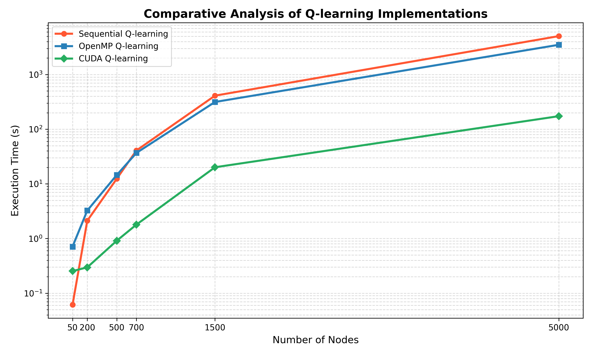
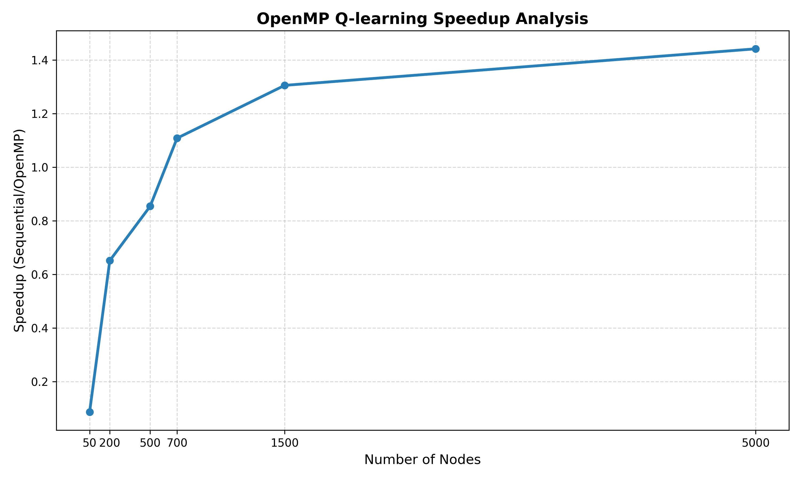
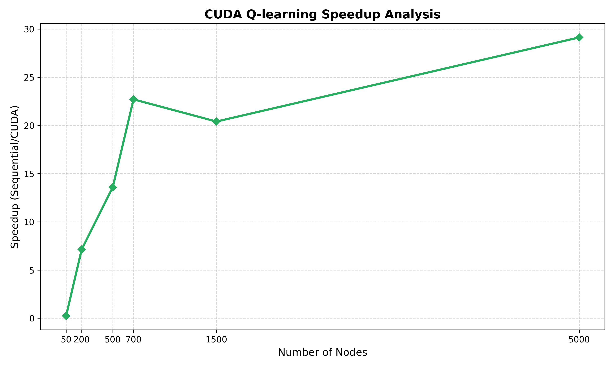

# High-Performance Computing (HPC) Project

This project demonstrates high-performance computing techniques, including parallel algorithms, performance optimizations, and benchmarking tools.

## Prerequisites

Ensure the following are installed:
- Python 3.8 or higher
- MPI (Message Passing Interface) library (e.g., OpenMPI or MPICH)

## Installation

1. Clone the repository:
   ```bash
   git clone <repository-url>
   cd final HPC
   ```

2. Verify MPI installation:
   ```bash
   mpirun --version
   ```

## Running the Code

1. Navigate to the project directory:
   ```bash
   cd c:\Users\varun\Downloads\final HPC
   ```

2. Compile and link the program:
   ```bash
   nvcc -c qlearningcuda.cu -o qlearningcuda.o -std=c++11 && \
   g++ -c qlearning_openMP.cpp -o qlearning_openMP.o -fopenmp -std=c++11 && \
   g++ -c qlearning.cpp -o qlearning.o -std=c++11 && \
   g++ -c main.cpp -o main.o -std=c++11 && \
   g++ main.o qlearning.o qlearning_openMP.o qlearningcuda.o -o main -fopenmp -L/usr/local/cuda/lib64 -lcuda -lcudart -lcurand
   ```

3. Run the compiled program:
   ```bash
   ./main
   ```

4. Check the terminal for output and the `results` folder for saved data.

## Results

The program outputs:
- Performance metrics (e.g., execution time, speedup, efficiency)
- Computation results from parallel algorithms

### Visualizations

Below are some visualizations generated during the analysis:

1. **Execution Time Comparison**  
   

2. **Speedup Analysis**  
   /
   

For more detailed analysis, refer to the `analysis` folder.

## Performance Analysis

The following table summarizes the execution times (in seconds) for different implementations of Q-learning and other algorithms across various node counts:

| Nodes | Sequential Q-learning | OpenMP Q-learning | CUDA Q-learning | Dijkstra's Algorithm | A* Search Algorithm |
|-------|------------------------|-------------------|-----------------|----------------------|---------------------|
| 50    | 0.0615737             | 0.711252          | 0.254046        | 0.00031301           | 0.00029464          |
| 200   | 2.11942               | 3.25352           | 0.297333        | 0.00227441           | 0.00064038          |
| 500   | 12.3951               | 14.5135           | 0.911919        | 0.0064032            | 0.00359426          |
| 700   | 40.7896               | 36.8152           | 1.79595         | 0.0340197            | 0.000864486         |
| 1000  | 410.857               | 314.82            | 20.1306         | 0.0742742            | 0.00834486          |
| 1500  | 5044.71               | 3514.49           | 173.149         | 3.32184              | 0.0727079           |

### Observations

- **CUDA Q-learning** demonstrates significant speedup compared to Sequential and OpenMP Q-learning, especially as the number of nodes increases.
- **Dijkstra's Algorithm** and **A* Search Algorithm** are highly efficient for smaller graphs but may not scale as well for larger graphs.
- **OpenMP Q-learning** provides moderate improvement over Sequential Q-learning but is outperformed by CUDA Q-learning.

For detailed visualizations and speedup analysis, refer to the plots generated in the `analysis` folder.

## Contributing

Contributions are welcome! Submit a pull request or open an issue.

## License

This project is licensed under the MIT License. See the `LICENSE` file for details.
